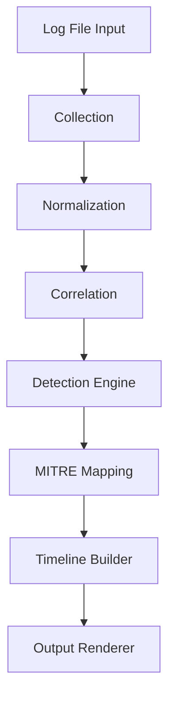

# Linux Attacker Timeline Detection Engine


A modular log analysis and detection framework that reconstructs attacker activity timelines and maps findings to MITRE ATT&CK techniques.

---

## 🔎 Overview

This engine ingests Linux authentication and system logs, normalizes events, correlates related activity, applies rule-based detection logic, maps alerts to MITRE ATT&CK techniques, and reconstructs attacker timelines.

It is designed as a modular, pipeline-based detection system with extensibility in mind.

---

## 🏗 Architecture

The detection engine follows a structured pipeline:
Log Input
↓
Parser
↓
Normalization
↓
Correlation
↓
Detection Engine
↓
MITRE Mapping
↓
Timeline Builder
↓
Output Renderer


Each stage is isolated by responsibility, allowing independent testing and evolution.

---

## 📂 Project Structure

src/
├── cli.py # CLI entry point
├── parser/ # Log parsing logic
│ └── log_parser.py
├── detection/
│ ├── rule_engine.py # Rule evaluation engine
│ ├── rule_registry.py # Rule registration & loading
│ └── rules/ # Individual detection rules
│ ├── ssh_bruteforce_success.py
│ ├── sudo_privilege_escalation.py
│ ├── reverse_shell.py
│ ├── new_user_creation.py
│ └── multi_stage_attack.py
├── correlator/ # Event correlation logic
├── timeline/ # Timeline reconstruction
├── output/ # CLI rendering / JSON formatting
tests/ # Pytest test suite


---

## 🚨 Detection Capabilities

Current implemented detections:

- SSH Brute Force Success
- Suspicious Privilege Escalation
- Reverse Shell Execution
- Unauthorized User Creation
- Multi-Stage Attack Correlation
- MITRE ATT&CK Technique Mapping

---

## 🧠 Multi-Stage Correlation

The engine can correlate multiple related events into a single critical alert:

Example chain:

Brute Force → Successful Login
→ Privilege Escalation
→ Reverse Shell
→ Backdoor User Creation


This enables detection of attacker kill chains rather than isolated events.

---


Design Principles

Modular detection engine

Clear separation of parsing, correlation, and detection

Deterministic rule-based evaluation

MITRE ATT&CK alignment

Extensible rule framework

CI-driven validation

## System Flow



### Component Responsibilities

**Collection**
- Ingests raw log input
- Handles file loading and basic validation

**Normalization**
- Transforms raw log lines into structured event objects
- Ensures consistent schema for downstream processing

**Correlation**
- Links related events into logical attack chains
- Enables multi-stage attack detection

**Detection Engine**
- Applies rule-based logic to normalized events
- Produces alert objects with severity classification

**MITRE Mapping**
- Maps detection results to MITRE ATT&CK techniques
- Adds tactic and technique context

**Timeline Builder**
- Orders correlated events chronologically
- Reconstructs attacker activity flow

**Output Renderer**
- Formats alerts and timelines for CLI output
- Future support: JSON export / SIEM integration


## Detection Capabilities

- Brute Force Login Detection (T1110)
- Suspicious Tool Transfer (T1105)
- Multi-Stage Attack Correlation
- Timeline Reconstruction
- MITRE ATT&CK Technique Mapping

## Usage
### 1️⃣ Clone the Repository

```bash
git clone https://github.com/djbpm/linux-attacker-timeline.git
cd linux-attacker-timeline
```

### 2️⃣ Install Dependencies

```bash
pip install -r requirements.txt
```

### 3️⃣ Run the Detection Engine

```bash
python -m src.cli --input src/sample.log
```

### 4️⃣ Run Test Suite

```bash
pytest
```

## Roadmap

- JSON export support
- Unit test coverage
- Structured logging
- CI pipeline
- Plugin rule system

Author: Kailas
