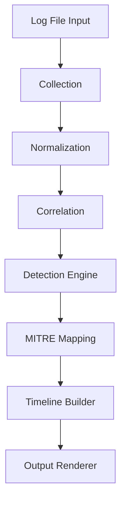

# Linux Attacker Timeline Detection Engine

A modular log analysis and detection framework that reconstructs attacker activity timelines and maps findings to MITRE ATT&CK techniques.

## Architecture

## System Flow

## Detection Capabilities

- Brute Force Login Detection (T1110)
- Suspicious Tool Transfer (T1105)
- Multi-Stage Attack Correlation
- Timeline Reconstruction
- MITRE ATT&CK Technique Mapping

## Usage

[ALERT] Suspicious Download Command
Severity: high
MITRE Technique: T1105 - Ingress Tool Transfer
Tactic: Command and Control

[ALERT] Brute Force Login Attempt
Severity: high
MITRE Technique: T1110 - Brute Force
Tactic: Credential Access

## Project Structure

src/
+-- collector/
+-- correlator/
+-- detection/
+-- intel/
+-- normalizer/
+-- output/
+-- timeline/

## Design Principles

- Modular detection engine
- Pattern-based correlation
- Frequency-aware detection logic
- MITRE ATT&CK alignment
- Extensible rule framework

## Roadmap

- JSON export support
- Unit test coverage
- Structured logging
- CI pipeline
- Plugin rule system

Author: Kailas
