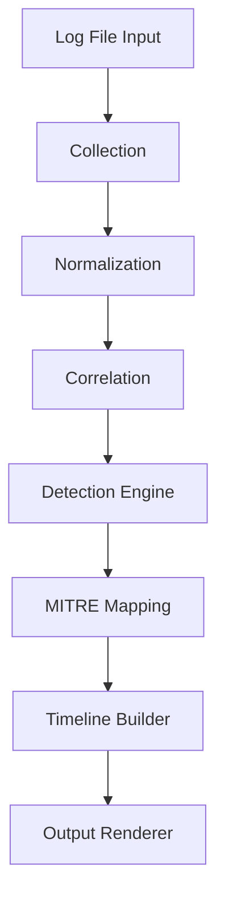

# Linux Attacker Timeline Detection Engine


A modular log analysis and detection framework that reconstructs attacker activity timelines and maps findings to MITRE ATT&CK techniques.

## Architecture
The detection engine follows a modular pipeline-based architecture.

Each stage is isolated by responsibility, allowing independent testing,
extension, and rule evolution without breaking upstream or downstream logic.

### Design Principles

- Separation of concerns between parsing, detection, and rendering
- Deterministic rule-based detection logic
- MITRE ATT&CK alignment for structured threat mapping
- Test-driven validation using pytest and CI
- Extensible rule engine for future plugin support

## System Flow



### Component Responsibilities

**Collection**
- Ingests raw log input
- Handles file loading and basic validation

**Normalization**
- Transforms raw log lines into structured event objects
- Ensures consistent schema for downstream processing

**Correlation**
- Links related events into logical attack chains
- Enables multi-stage attack detection

**Detection Engine**
- Applies rule-based logic to normalized events
- Produces alert objects with severity classification

**MITRE Mapping**
- Maps detection results to MITRE ATT&CK techniques
- Adds tactic and technique context

**Timeline Builder**
- Orders correlated events chronologically
- Reconstructs attacker activity flow

**Output Renderer**
- Formats alerts and timelines for CLI output
- Future support: JSON export / SIEM integration


## Detection Capabilities

- Brute Force Login Detection (T1110)
- Suspicious Tool Transfer (T1105)
- Multi-Stage Attack Correlation
- Timeline Reconstruction
- MITRE ATT&CK Technique Mapping

## Usage
### 1️⃣ Clone the Repository

```bash
git clone https://github.com/djbpm/linux-attacker-timeline.git
cd linux-attacker-timeline
```

### 2️⃣ Install Dependencies

```bash
pip install -r requirements.txt
```

### 3️⃣ Run the Detection Engine

```bash
python -m src.cli --input src/sample.log
```

### 4️⃣ Run Test Suite

```bash
pytest
```


## Project Structure

src/
+-- collector/
+-- correlator/
+-- detection/
+-- intel/
+-- normalizer/
+-- output/
+-- timeline/

## Design Principles

- Modular detection engine
- Pattern-based correlation
- Frequency-aware detection logic
- MITRE ATT&CK alignment
- Extensible rule framework

## Roadmap

- JSON export support
- Unit test coverage
- Structured logging
- CI pipeline
- Plugin rule system

Author: Kailas
